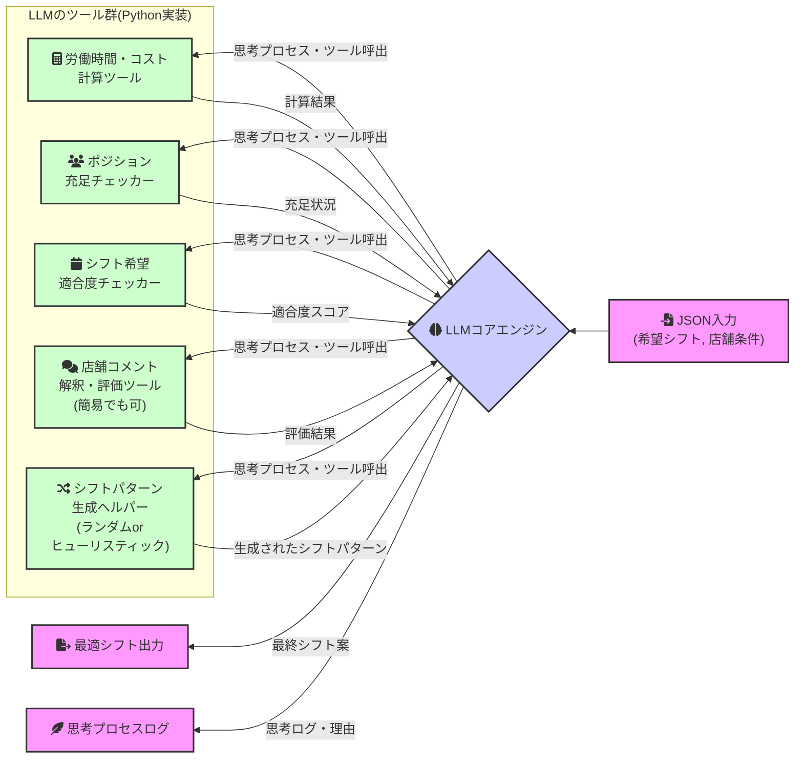

```mermaid
graph RL
A["fa:fa-file-import JSON入力
(希望シフト, 店舗条件)"] --> B{"fa:fa-brain LLMコアエンジン"};

subgraph "LLMのツール群(Python実装)"
    C["fa:fa-calculator 労働時間・コスト
    計算ツール"]
    D["fa:fa-users ポジション
    充足チェッカー"]
    E["fa:fa-calendar シフト希望
    適合度チェッカー"]
    F["fa:fa-comments 店舗コメント
    解釈・評価ツール
    (簡易でも可)"]
    G["fa:fa-random シフトパターン
    生成ヘルパー
    (ランダムor
    ヒューリスティック)"]
end

B -- "思考プロセス・ツール呼出" --> C;
B -- "思考プロセス・ツール呼出" --> D;
B -- "思考プロセス・ツール呼出" --> E;
B -- "思考プロセス・ツール呼出" --> F;
B -- "思考プロセス・ツール呼出" --> G;

C -- "計算結果" --> B;
D -- "充足状況" --> B;
E -- "適合度スコア" --> B;
F -- "評価結果" --> B;
G -- "生成されたシフトパターン" --> B;

B -- "最終シフト案" --> H["fa:fa-file-export 最適シフト出力"];
B -- "思考ログ・理由" --> I["fa:fa-feather-alt 思考プロセスログ"];

%% スタイル定義
classDef default fill:#f9f,stroke:#333,stroke-width:2px;
classDef llmCore fill:#ccf,stroke:#333,stroke-width:2px;
classDef tool fill:#cfc,stroke:#333,stroke-width:2px;

class B llmCore;
class C,D,E,F,G tool;

```

